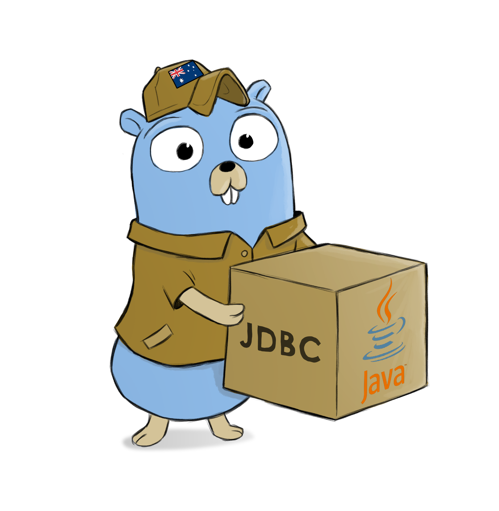

# GDBC - Golang JDBC Driver Wrapper

[](https://circleci.com/gh/identitii/gdbc/tree/master)
[](https://godoc.org/github.com/identitii/gdbc) 
[](https://raw.githubusercontent.com/identitii/gdbc/master/LICENSE)

Load and use JDBC Java database drivers from go. Without Java.

## IMPORTANT NOTES:
 - This is VERY MUCH WIP - it 'works' but has barely been tested/benchmarked. PRs/bug reports/feature requests gratefully received.
 - This repository will change. Do not rely on it yet. Compatibility is not guaranteed.
 - Very likely the drivers will be split into their own modules or repos.


### Supported Drivers

More may be supported, but these are the ones we package, test, and distribute.

- Microsoft SQL Server (mssql)
  - com.microsoft.sqlserver:mssql-jdbc:7.3.0.jre8-preview
- Oracle DB (oracle)
  - com.oracle:ojdbc6:12.1.0.1
- PostgreSQL (postgresql)
  - org.postgresql:postgresql:42.2.5.jre6

### Usage

Import oracle, mssql, or postgresql driver.

```golang
import _ "github.com/identitii/gdbc/oracle"
```

Use `gdbc-(oracle|mssql|postgresql)` as the driver name, and pass in the JDBC connection string (which is passed straight through to the driver)

```golang
pool, err = sql.Open("gdbc-oracle", "jdbc:oracle:thin:user/password@host:1521:sid")
```

When starting your application, it will look for the compiled driver shared library in the current directory (@executable_path)
e.g. libgdbc-postgresql.dylib on mac, or libgdbc-postgresql.so on linux.

So either put the file in the current directory, or tell it where to find it like this...

```bash
DYLD_LIBRARY_PATH="path/to/the/shared/library" go run main.go
```

### Benchmarks

The one tiny benchmark so far has these GDBC drivers about 30% faster than the pure go drivers on mac, and about 30% slower than the pure go drivers on linux.
 
### How is this done?

GraalVM to package the java driver as a native library, then CGO to communicate with it.

### Why is this done?

Because there are some databases that don't have or have incomplete or unsupported go drivers. 

Initially started in order to get a fully featured oracle driver.

Also because it is fun.

### TODO

 - [ ] Find trusted maven repositories to download drivers
 - [ ] Transaction isolation level config via driver
 - [ ] Distribute binary drivers (.dylib and .so, and .dll?) via separate repositories
 - [x] Cut down the binary size from 120mb to something slightly more reasonable. (done: now 30mb)
   - [x] Get rid of -H:IncludeResources=".*"
 - [ ] Extend test suite, find existing suite?
 - [ ] Test memory usage/leaking
 - [x] Linux builds
 - [ ] Windows builds (waiting on graalvm support)
 - [x] CI/CD
 - [ ] Implement further interfaces 
   - [x] sql/driver.Pinger
   - [ ] sql/driver.RowsColumnTypeDatabaseTypeName
   - [ ] sql/driver.RowsColumnTypeLength
   - [ ] sql/driver.RowsColumnTypeNullable
   - [ ] sql/driver.RowsColumnTypePrecisionScale
   - [ ] sql/driver.NamedValueChecker
 - [x] Allow driver specific extensions
   - [ ] Oracle continuous query notification - https://docs.oracle.com/database/121/JJDBC/dbchgnf.htm#JJDBC28815

#### Drivers
 - [ ] sqlite? ("org.sqlite.JDBC" "jdbc:sqlite::memory:" "SELECT 1;")

### Who Created This


We're a fintech startup based in Sydney, Australia. 

Find this project interesting? Why not come work with us.

https://identitii.com/careers/

### Thanks

https://github.com/japettyjohn/go-jdbc, which itself is partly based on https://github.com/xoba/goutil

gopher logo by Mario Furmanczyk (mfurmanc on fiverr)